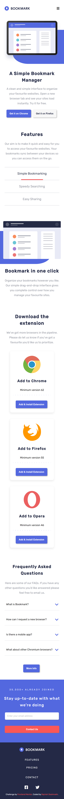
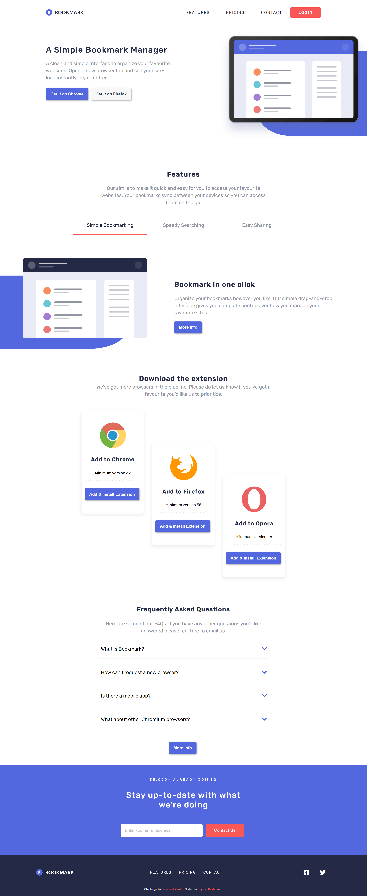

# Frontend Mentor - Bookmark landing page solution

This is a solution to the [Bookmark landing page challenge on Frontend Mentor](https://www.frontendmentor.io/challenges/bookmark-landing-page-5d0b588a9edda32581d29158). Frontend Mentor challenges help you improve your coding skills by building realistic projects.

## Table of contents

- [Overview](#overview)
  - [The challenge](#the-challenge)
  - [Screenshot](#screenshot)
  - [Links](#links)
- [My process](#my-process)
  - [Built with](#built-with)
  - [What I learned](#what-i-learned)
  - [Useful resources](#useful-resources)
- [Author](#author)

## Overview

### The challenge

Users should be able to:

- View the optimal layout for the site depending on their device's screen size
- See hover states for all interactive elements on the page
- Receive an error message when the newsletter form is submitted if:
  - The input field is empty
  - The email address is not formatted correctly

### Screenshot




### Links

- Solution URL: [frontend mentor](https://www.frontendmentor.io/profile/drajnish/solutions)
- Live Site URL: [github pages](https://drajnish.github.io/bookmark/)

## My process

### Built with

- Semantic HTML5 markup
- CSS custom properties
- Flexbox
- Mobile-first workflow
- [font awsome](https://fontawesome.com/) - For fonts

### What I learned

```html
<div class="error-control">
  <input
    type="email"
    class="email"
    id="email"
    placeholder="Enter your email address"
  />
  <i class="fas fa-check-circle"></i>
  <i class="fas fa-exclamation-circle"></i>
  <small>Error message</small>
</div>
```

```js
function isEmail(email) {
  return /^(([^<>()\[\]\\.,;:\s@"]+(\.[^<>()\[\]\\.,;:\s@"]+)*)|(".+"))@((\[[0-9]{1,3}\.[0-9]{1,3}\.[0-9]{1,3}\.[0-9]{1,3}])|(([a-zA-Z\-0-9]+\.)+[a-zA-Z]{2,}))$/.test(
    email
  );
}
```

### Useful resources

- [form validation](https://www.youtube.com/watch?v=rsd4FNGTRBw&ab_channel=FlorinPop) - This helped me to validate email using regular expression in javascript.

## Author

- Frontend Mentor - [@drajnish](https://www.frontendmentor.io/profile/drajnish)
- Twitter - [@DeshmukhRajnish](https://www.twitter.com/DeshmukhRajnish)
